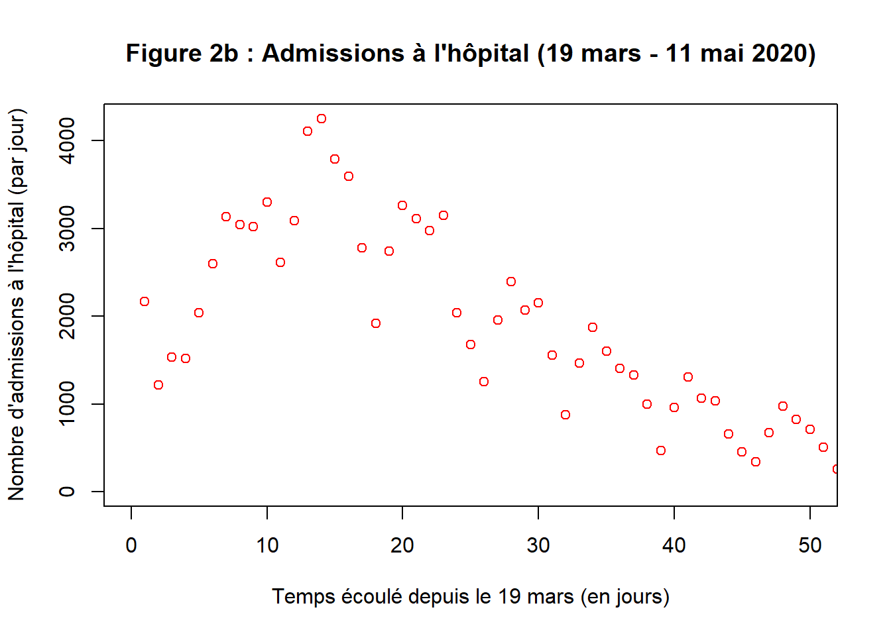

<!DOCTYPE html>

<html>

<head>

<meta charset="utf-8" />
<meta name="generator" content="pandoc" />
<meta http-equiv="X-UA-Compatible" content="IE=EDGE" />

<meta name="author" content="P. Cuchot, P. Fournier, M. Faucher - M2 MODE" />

</head>

<body>

<h1 class="title toc-ignore">Le rebond de la pandémie de la Covid-19 était-il prévisible?</h1>
<h4 class="author">P. Cuchot, P. Fournier, M. Faucher - M2 MODE</h4>
<h4 class="date">23/12/2020</h4>

   $(document).ready(function() {
     $head = $('#header');
     $head.prepend('')
   });

<h1>Introduction</h1>

Lors de l’annonce du premier confinement général en France le 17 mars 2020, les connaissances scientifiques ainsi que les relevés d’hospitalisations permettaient déjà la publication d’articles estimant le taux d’incidence de la Covid-19 (Roques <em>et al.</em>, 2020), l’évolution de la pandémie selon les stratégies de déconfinement (Di Domenicali <em>et al.</em>, 2020) ou encore des estimations du nombre de décès évités grâce au confinement (Roux <em>et al.</em>, 2020). A l’occasion du deuxième confinement débuté le 30 octobre et ayant pris fin le 16 décembre, il est intéressant de chercher à savoir si la situation actuelle pouvait être envisagée dès la levée du premier confinement. Nous avons cherché à savoir si un modèle épidémiologique réalisé à partir des données d’hospitalisation recueillies pendant la période du confinement permettait de prévoir l’accélération du nombre de cas débutée en juillet.

Pour répondre à cette question, un modèle de type SIHR (figure 1) a été ajusté aux données d’hospitalisation liées à la Covid-19 pendant la période de confinement, mises à disposition sur le site de Santé Publique France. Les résultats obtenus avec ce modèle ont ensuite été comparés avec les données réelles, de la sortie du confinement à la date du 03 novembre 2020.

Le traitement des données ainsi que le système d’équations du modèle ont été librement inspirés de <a href="http://f.m.hamelin.free.fr/covid-19.html">F. Hamelin</a>.

<h1>Méthodes</h1>

Pour réaliser ce modèle, nous nous sommes intéressés aux données délivrées par les hôpitaux de France car elles sont un indicateur fiable et accessible de l’évolution de la pandémie. De plus l’effort de recensement de ces données ne devrait pas avoir beaucoup varié tout au long de la période d’étude en opposition à l’effort de test des personnes non hospitalisées.

Les connaissances actuelles concernant la durée d’immunité, l’existence d’une différence de contagiosité entre les formes asymptomatiques et les formes symptomatiques, ou encore les différences de réponse selon les individus nous ont poussé à garder un modèle qui soit le plus simple possible. Nous avons donc opté pour un modèle de type SIR auquel nous avons ajouté un compartiment H pour les individus hospitalisés. Nous avons aussi cherché à limiter le nombre de paramètres à estimer pour éviter le surparamétrage du modèle, mais aussi pour ne conserver que des paramètres ayant déjà été estimés dans la littérature.

<h2>Le modèle épidémiologique</h2>

Les hypothèses sous-jacentes au modèle utilisé sont les suivantes :

<ul>
<li>La population française est spatialement homogène au sein de l’Hexagone 
</li>
<li>La population est divisée en groupes d’individus homogènes : tous les individus quelque soit leur âge, leur sexe et leur antécédents médicaux sont égaux vis à vis du virus 
</li>
<li>Le taux de mortalité lié à la maladie ne varie pas 
</li>
<li>La taille de la population est stable au cours du temps (pas de dynamique démographique) 
</li>
<li>La transmission du virus autre que par contact est négligée 
</li>
<li>Le R(t) est stable dans le temps 
</li>
<li>La guérison de la Covid-19 confère une immunité permanente 
</li>
<li>Les individus hospitalisés ne peuvent plus contaminer les individus susceptibles 
</li>
<li>Les paramètres associés au temps d’infection, d’hospitalisation et de guérison, ainsi que les taux de contagion et d’hospitalisation sont constants</li>
</ul>

Les différents compartiments du modèles ont été définis de la façon suivante :

<em>\(S(t)\) : Nombre d’individus sensibles au virus au temps t 
</em>\(I(t)\) : Nombre d’individus infectés et infectieux non hospitalisés au temps t 
<em>\(H(t)\) : Nombre d’individus infectés et hospitalisés au temps t 
</em>\(R(t)\) : Nombre d’individus retirés de la dynamique de l’épidémie (décédés ou immunisés) au temps t

Nous définissons la taille de la population tel que N = S + I + H + R = constante

Les paramètres du modèle sont les suivants :

γ : taux de sortie de l’hôpital via guérison ou décès (inverse du temps moyen passé à l’hôpital) 
α : taux d’hospitalisation (inverse du temps moyen avant hospitalisation) 
ρ : taux de sortie de l’état infecté via guérison ou décès (inverse du temps moyen avant guérison ou décès) 
β : taux de transmission du virus par unité de temps (R(t) * ρ).

Le modèle SIHR utilisé est schématisé ci-dessous …

<h4>figure 1 : Schéma représentatif du modèle SIHR</h4>

… et est traduit sous forme mathématiques ci-après:

\(\frac{dS}{dt}=-\beta\frac{S}{N}I\)

\(\frac{dI}{dt}=\beta\frac{S}{N}I-(\alpha+\rho)I\)

\(\frac{dH}{dt}=\alpha I-\gamma H\)

\(\frac{dR}{dt}=\rho I+\gamma H\) 

Nous avons ensuite essayé d’ajuster le modèle aux données réelles pour la période du premier confinement (17 mars au 11 mai 2020). Les données en question sont le nombre de personnes hospitalisés et le nombre d’admission à l’hôpital à la date t.

<h2>Application</h2>

<h3>Chargement des packages</h3>
<pre class="r"><code>library(rmarkdown)
library(deSolve)
library(ggplot2)</code></pre>

<h3>Chargement des données</h3>

Les données ont été téléchargées <a href="https://www.data.gouv.fr/fr/datasets/donnees-hospitalieres-relatives-a-lepidemie-de-covid-19/">ici</a>. Les jeux de données contiennent des données hospitalières relatives à l’épidémie du COVID-19 par département et sexe du patient.

Etant donné que notre travail a été basé sur les données couvrant la période du début du premier confinement au 03 novembre 2020, nous avons stocké en ligne les données utilisées pour réaliser ce travail.

<pre class="r"><code>dataH &lt;- read.csv(&quot;https://raw.githubusercontent.com/martin-faucher/etude_covid_19/main/donnees-hospitalieres-covid19-2020-11-03-19h00.csv&quot;, sep = &quot;;&quot;)
dataA &lt;- read.csv(&quot;https://raw.githubusercontent.com/martin-faucher/etude_covid_19/main/donnees-hospitalieres-nouveaux-covid19-2020-11-03-19h00.csv&quot;, sep = &quot;;&quot;)</code></pre>

dataH contient : nombre de patients hospitalisés, nombre de personnes actuellement en réanimation ou soins intensifs, nombre cumulé de personnes retournées à domicile, nombre cumulé de personnes décédées.

dataA contient des données quotidiennes : nombre quotidien de personnes nouvellement hospitalisées, nombre quotidien de nouvelles admissions en réanimation, nombre quotidien de personnes nouvellement décédées, nombre quotidien de nouveaux retours à domicile.

<h3>Sélection des données d’interêt pour le projet</h3>

Nous avons d’abord sélectionné les données d’interêt pour répondre à la question posée, soit les données relatives aux hospitalisations et admissions par département, agrégeant hommes et femmes.

Dans une volonté de clarté du document, les lignes de codes permettant de préparer le jeu de données à l’analyse, ne sont pas présentées dans le document. Vous pouvez retrouver le traitement des données directement dans le script ayant servi de base à ce document.

<h4>Visualisation des données à partir du 19 mars</h4>
<pre class="r"><code>plot(1:LH,H,xlab=&quot;Temps écoulé depuis le 19 mars (en jours)&quot;,
     ylab=&quot;Nombre de personnes hospitalisées&quot;, 
     main = &quot;Figure 2a : Hospitalisations (19 mars - 11 mai 2020)&quot;, col=&quot;blue&quot;, xlim=c(0,50))</code></pre>

<pre class="r"><code>plot(1:LA,A,xlab=&quot;Temps écoulé depuis le 19 mars (en jours)&quot;,
     ylab=&quot;Nombre d&#39;admissions à l&#39;hôpital (par jour)&quot;,
     main = &quot;Figure 2b : Admissions à l&#39;hôpital (19 mars - 11 mai 2020)&quot;, col=&quot;red&quot;,xlim=c(0,50))</code></pre>

Nous observons une tendance croissante du nombre de personnes hospitalisées (figure 2a) ainsi que du nombre d’admission (figure 2b) sur les 15 premiers jours. Cependant, les pentes de H et A s’atténuent peu à peu. Nous attribuons ces tendances à une dynamique de transition suite à la mise en place du confinement. Le modèle utilisé ici, suppose que les paramètres sont constants au cours du temps. Pour cette raison, la simulation du modèle commencera 15 jours après le début du confinement, soit à partir du 1er Avril 2020. 

En outre, les données d’admission sont plus éparses que les données d’hospitalisation et semblent ainsi moins estimables. Ce phénomène peut être du à une remontée partielle des informations en fin de semaine en raison de la fermeture de certains services administratifs. Ceci se caractérise par de plus faibles admissions les week-ends et jours fériés ainsi que des pics d’admissions en début de semaine. 

Pour ces raisons, nous appliquerons notre modèle sur les données d’hospitalisation.

<h4>Visualisation des données tronquées à partir du 1er avril</h4>
<pre class="r"><code>plot(1:LH,H,xlab=&quot;Temps écoulé depuis le 1er avril (en jours)&quot;,
     ylab = &quot;Nombre d&#39;hospitalisations et admissions&quot;,
     main=&quot;Figure 3 : Hospitalisations et admissions journalières \n (1 avril - 11 mai 2020)&quot;,
     col=&quot;blue&quot;, ylim = c(1,40000), type=&#39;l&#39;)
points(1:LA,A, type=&#39;l&#39;)

par(bty=&quot;l&quot;)
legend(x=22, y=40000,legend=c(&quot;Personnes hospitalisées&quot;, &quot;Personnes admises&quot;), text.font=2, lty=1,
       col=c(&quot;black&quot;,&quot;blue&quot;), box.lty = 0, bty=&quot;l&quot;)</code></pre>

<h3>Ecriture du modèle</h3>

Avant d’ajuster le modèle aux données françaises, il est nécessaire de leur attribuer une valeur initiale. Il est nécessaire de fixer au moins un paramètre, pour que le modèle ne soit pas sur-paramétré par rapport aux données utilisées (Sallet et Rapaport <em>in</em> <a href="http://f.m.hamelin.free.fr/covid-19.html" class="uri">http://f.m.hamelin.free.fr/covid-19.html</a>). Nous fixons donc \(\rho\), qui a été estimé en Chine par You <em>et al</em>. (2020) à 10,91 jours en moyenne.

<pre class="r"><code>N &lt;- 64e6                    # Population hexagonale approximative
rho &lt;- 1/10.91                # Taux de sortie de l&#39;état infecté 
gamma &lt;- 1/14                 # Taux de sortie de l&#39;hôpital
R_0 &lt;- 1                      # Nombre de reproduction de base en confinement
beta &lt;- R_0*rho               # Taux de transmission (calcul très approximatif)
p &lt;- 0.1                      # Probabilité d&#39;être hospitalisé suite à l&#39;infection
alpha &lt;- p*rho/(1-p)          # Taux d&#39;hospitalisation
P0 &lt;- c(beta,alpha,gamma)     # Vecteur des paramètres</code></pre>

Définition des variables du modèle et des conditions initiales (1er avril) :

<pre class="r"><code>H0 &lt;- H[1]        # Nombre de personnes hospitalisées au 1er avril
I0 &lt;- A[1]/alpha  # D&#39;après le modèle, A(t) = alpha*I(t)
R0 &lt;- N*0.01      # Fixé arbitrairement à 1% d&#39;immunisés 
S0 &lt;- N-I0-H0-R0  # Taille de la population sensible au 1er avril
X0 &lt;- c(S0,I0,H0) # Vecteur d&#39;état.

# Construction d&#39;un vecteur de dates pour comparer le modèle et les données :
t &lt;- 0:(LH-1)</code></pre>

Définition du système d’équation SIHR 
La fonction SIHR prend en argument 3 vecteurs : le temps, les variables d’état, et les paramètres :

<pre class="r"><code>SIHR = function(t, X, P){
  beta &lt;- P[1];            # Taux de transmission
  alpha &lt;- P[2];           # Taux d&#39;hospitalisation
  gamma &lt;- P[3];           # Taux de sortie d&#39;hôpital
  
  S &lt;- X[1]
  I &lt;- X[2]
  H &lt;- X[3] # Le vecteur d&#39;état X contient S, I, et H
  
  y = beta*S*I/N;       # Nombre de nouvelles infections par jour
  
  # D&#39;après le modèle SIHR défini plus haut :
  dS = -y;              #  dS/dt = - beta*S*I
  dI = y-(alpha+rho)*I; #  dI/dt = beta*S*I - (alpha+rho)*I
  dH = alpha*I -gamma*H;#  dH/dt = alpha*I - gamma*H
  
  dX=c(dS,dI,dH);       # Renvoie dX/dt, mise en forme demandée par la fonction ode().
  
  return(list(dX));
}</code></pre>

Afin d’ajuster le modèle SIHR aux données françaises, nous cherchons à estimer les paramètres alpha, beta et gamma ainsi que l’état initial du système tels qu’ils soient les plus vraisemblables d’après les données. Pour calculer cette vraisemblance, nous modélisons le processus d’observation de façon stochastique.

<h3>Maximisation du log de la vraisemblance du modèle</h3>

Création d’une fonction qui calcule la log-vraisemblance d’un jeu de paramètres et de conditions initiales. La fonction logLike prend pour argument un vecteur de paramètres et de conditions initiales à estimer : beta, alpha, gamma, S, I, H.

<pre class="r"><code>logLike=function(theta){
  P &lt;- theta[1:3];           # Paramètres beta (taux de transmission), alpha (taux d&#39;hospitalisation), et gamma (taux de sortie d&#39;hôpital)
  X0 &lt;- theta[4:6];          # Conditions initiales 
  
  X &lt;- ode(X0,t,SIHR,P)      # Résolution du système 
  
  h &lt;- X[,4];                # Hospitalisations théoriques : H(t)
  a &lt;- P[2]*tail(X[,3],-1);  # Admissions théoriques : alpha*I(t)
  
  LLH &lt;- dpois(H,h,log=T)    # Probabilité d&#39;observer H (loi de Poisson)
  LLA &lt;- dpois(A,a,log=T)    # Probabilité d&#39;observer A (loi de Poisson)
  LL &lt;- sum(c(LLH,LLA))      # Log transformation du produit des probabilités en somme
  return(LL);                # Renvoie la log-vraisemblance 
}</code></pre>

Définition du vecteur des paramètres et des conditions initiales utilisé dans la fonction logLike. 
Ici, P0 = c (beta,alpha,gamma) et X0 = c(S, I, H).

<pre class="r"><code>theta0 &lt;- c(P0,X0)</code></pre>

La fonction optim estime les valeurs des paramètres et conditions initiales maximisant la vraisemblance du modèle.

<h1>Résultats</h1>

Valeurs des paramètres et conditions initiales dont la vraisemblance est maximale :

<pre class="r"><code>beta &lt;- opt$par[1]   # beta (taux de transmission)
alpha &lt;- opt$par[2]  # alpha (taux d&#39;hospitalisation)
gamma &lt;- opt$par[3]  # gamma (taux de sortie d&#39;hopital)</code></pre>

Les valeurs des paramètres optimaux correspondent à :

<strong>0.0641775</strong> pour le taux de transmission 
<strong>0.0078065</strong> pour le taux de d’hospitalisation 
<strong>0.0584921</strong> pour le taux de sortie de l’hopital

Selon le modèle, les conditions initiales optimales sont :

<pre class="r"><code>S0 &lt;- opt$par[4]
I0 &lt;- opt$par[5]
H0 &lt;- opt$par[6]</code></pre>

Les valeurs des conditions initiales maximisant la vraisemblance correspondent à : 
<strong>6.293554310^{7}</strong> individus sensibles 
<strong>4.037580610^{5}</strong> individus infectieux 
<strong>2.069943510^{4}</strong> individus infectés hospitalisés

Mise à jour des vecteurs des paramètres et conditions initiales avec les nouvelles valeurs estimées :

<pre class="r"><code>P0 &lt;- c(beta,alpha,gamma);         # Vecteur des paramètres 
X0 &lt;- c(S0,I0,H0);                 # Vecteur des conditions initiales</code></pre>

<h3>Simulation du modèle avec les nouveaux paramètres et conditions initiales</h3>
<pre class="r"><code>T=219 
t=0:T      # Mise à jour du vecteur temps</code></pre>

Simulation du modèle à partir du 12 mai 2020

<h3>Comparaison visuelle de la simulation et des données françaises</h3>

Depuis la levée du confinement, le nombre d’hospitalisation/jour a connu un rebond (figure 4). Le modèle ajusté sur les données françaises prédisait un maintien de la diminution du taux d’hospitalisations journalière après la levée du confinement .

Le modèle utilisé a été ajusté aux données réelles pendant le confinement. Or la majeure différence entre une population confinée et une population non confinée est le taux de contact.

Pour aller plus loin, nous essayons d’intégrer dans un second modèle l’augmentation du taux de contact entre humains à la sortie du confinement. Pour cela, nous augmentons la valeur du taux de transmission du virus (beta). Nous cherchons à visualiser pour quelle valeur de beta, le modèle ajusté aux données aurait pu prédire un rebond.

<h3>Utilisation du même modèle en sortie de confinement induisant une hausse du taux de transmission</h3>

Nous simulons maintenant notre modèle ajusté en prenant pour conditions initiales, les valeurs de S, I et H estimées pour le 11 mai lors de la première simulation. Dans ce modèle nous gardons les valeurs des paramètres alpha et gamma ajustées par la fonction logLike. Nous simulons le modèle jusqu’au 03 novembre en utilisant différentes valeurs pour beta qui soient plus élevées que celle ajustée pour le premier modèle.

Création d’une liste contenant les simulations pour chaque valeur de beta

<pre class="r"><code>X_list &lt;- list()</code></pre>

Les conditions initiales correspondent aux valeurs de S, I et H estimées pour le 11 mai lors de la première simulation

<pre class="r"><code>S0 &lt;- X[43,2]
I0 &lt;- X[43,3]
H0 &lt;- X[43,4]

X0 &lt;- c(S0,I0,H0)</code></pre>

On récupère les paramètres optimaux, en modifiant le taux de transmission. Les valeurs de \(\beta\) testées varient de 0,064 à 0,124 avec un pas de 0,01.

<pre class="r"><code>i &lt;- 1 # Compteur nécessaire pour remplir X_list
for(beta in seq(0.064,0.15,by=0.01)){
  
  alpha &lt;- opt$par[2]         # alpha (taux d&#39;hospitalisation)
  gamma &lt;- opt$par[3]         # gamma (taux de sortie de l&#39;hopital)
  
  P0 &lt;- c(beta,alpha,gamma);         # Vecteur des paramètres mis à jour
  
  # Les solution du modèle sont calculées pour les paramètres et conditions initiales estimés :
  
  T=219
  t=0:T            # Mise à jour du vecteur temps
  
  X_list[[i]]=ode(X0,t,SIHR,P0)    # Calcul de la solution 
  i &lt;- i+1
}</code></pre>

Affichage du nombre d’individus hospitalisés (données et modèle)

<em>Nota bene</em> : les valeurs de \(\beta\) pour la figure 5 sont les suivantes (couleur courbe, valeur) : rouge, 0,064 ; vert, 0,074 ; bleu, 0,084 ; cyan, 0,094 ; violet, 0,104 ; jaune, 0,114 ; gris, 0,124.

<h1>Discussion</h1>

Le modèle ajusté sur les données françaises au cours du premier confinement a prédit un maintien de la diminution du nombre d’hospitalisations après la levée du confinement. Ce modèle ne permettait donc pas de prédire le rebond observé dans le nombre d’hospitalisations.

L’efficacité du confinement tient dans le fait que le taux de contact entre humains est drastiquement réduit. Ce taux de contact apparaît dans le modèle à travers le paramètre \(\beta\) (taux de transmission du virus). Le modèle a été ajusté sur les données du confinement et suppose une constance de la valeur de ses paramètres au cours du temps. Il ne pouvait donc pas prévoir un rebond de l’épidémie après la levée du confinement.

Ici nous avons cherché pour quelles nouvelles valeurs de \(\beta\) le modèle aurait pu prévoir un rebond lors du déconfinement. Pour cela nous avons fait varier les valeurs de \(\beta\) entre 0.064 et 0.144. Pour des valeurs inférieures à 0.094, le modèle a prévu un maintien de la diminution du nombre de cas. Pour des valeurs égales ou supérieures à 0.104, le modèle a prévu un rebond de l’épidémie suivant le déconfinement (figure 4).

Le déconfinement s’est accompagné d’autres modifications - moins majeures que le taux de contact - dans les valeurs des paramètres du modèle. Par exemple le taux de sortie de l’hôpital a été réduit au cours de l’épidémie, en raison des progrès réalisés sur la prise en charge des patients.

En plus de la réaugmentation prévisible du taux de transmission lié à la fin du 1er confinement et à l’augmentation annuelle des déplacements pendant la période estivale, la possibilité d’une seconde vague - et donc certainement d’un second confinement - était envisagée, ne serait-ce que parce que la part de la population ayant été infectée était trop faible pour atteindre une immunité de groupe (Wise, 2020). D’autres scientifiques alertaient aussi du risque de seconde vague causé par d’autres critères, notamment l’arrivée des maladies hivernales, la fatigue du personnel médical, ou encore la réticence des gouvernements à imposer des mesures restrictives (Middleton <em>et al.</em>, 2020). En ce qui concerne la possibilité d’une troisième vague, les campagnes de vaccination ayant débuté dans plusieurs pays nous permettent d’être optimistes et d’oser penser que si elle survenait, les conséquences sur l’économie, la santé, et plus globalement notre quotidien seraient réduites.

<h2>Bibliographie</h2>

Di Domenico, L., Pullano, G., Sabbatini, C. E., Boëlle, P-Y. et Colizza, C., 2020. Impact of lockdown on COVID-19 epidemic in Île-de-France and possible exit strategies. <em>BMC Medicine</em>, <strong>18</strong>:240.

Middleton, J., Lopes, H., Michelson, K. et Reid, J., 2020. Planning for a second wave pandemic of COVID-19 and planning for winter. <em>International Journal of Public Health</em>, <strong>65</strong>:1525–1527.

Roques, L., Klein, E. K., Papaïx, j., Sar, A. et Soubeyrand, S., 2020. Impact of Lockdown on the Epidemic Dynamics of COVID-19 in France. <em>Frontiers in Medicine</em>, <strong>7</strong>:274.

Roux, J., Massonnaud, C., et Crépey, P., 2020. COVID-19: One-month impact of the French lockdown on the epidemic burden. medRxiv.

Wise, J., 2020. Covid-19: Risk of second wave is very real, say researchers. <em>British Medical Journal (Online)</em>, <strong>369</strong>.

You, C., Deng, Y., Hu, W., Sun, J., Lin, Q., Zhou, F., … et Zhou, X. H., 2020. Estimation of the time-varying reproduction number of COVID-19 outbreak in China. <em>International Journal of Hygiene and Environmental Health</em>, <strong>228</strong>:113555.

<!-- tabsets -->

<!-- code folding -->

<!-- dynamically load mathjax for compatibility with self-contained -->

</body>
</html>
